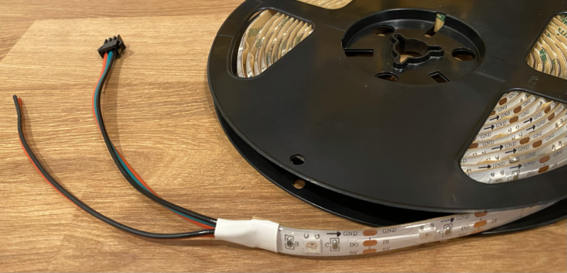
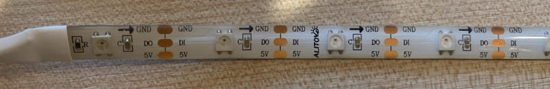
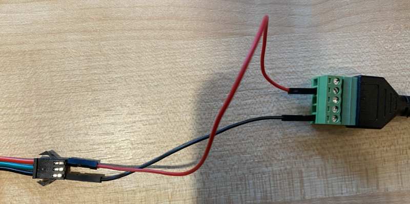
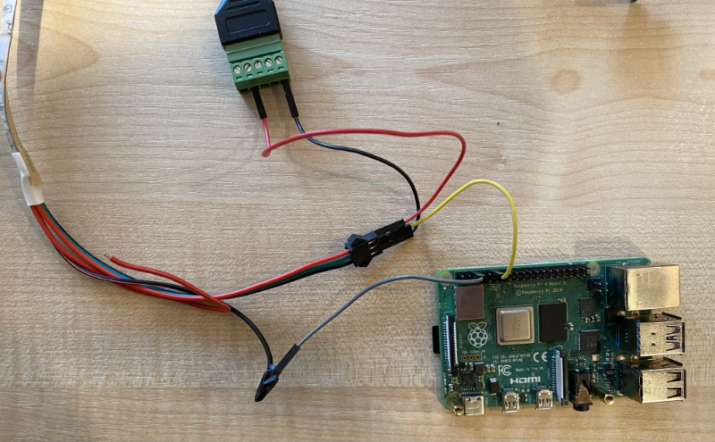
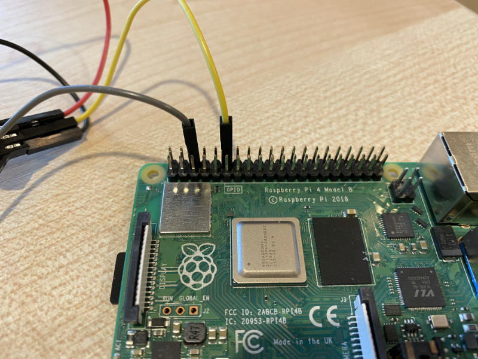
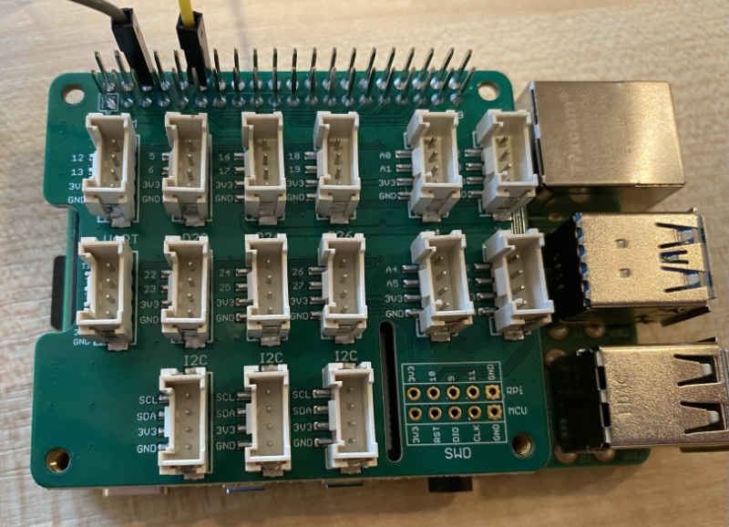

# 🎃 Tech Or Treat 👻

It's spooky season for those who celebrate Halloween, and to get in the spirit (spirit - get it? 👻) we thought it would be fun to hack on some pumpkins and power them with some electronics and IoT goodness!

We'll be live streaming our pumpkin hacks on the [Microsoft Reactor](https://developer.microsoft.com/reactor/?WT.mc_id=academic-47288-jabenn), so watch along with us, or catch the recording if you are busy haunting a house or doing the monster mash!

You can register for the live stream at the following link:

[](https://aka.ms/TechandTreatRegistration)

<!-- Uncomment when the video is live
You can watch the recording by selecting the image below:

[](https://aka.ms/techandtreat)
-->

## Hacking your own pumpkin

We've included some samples and instructions here should you want to hack your own pumpkin. These samples are in Python and C#.

### Hardware

We've based these samples on the following hardware:

Parts List:

- [LEDs](https://www.amazon.com/dp/B09BN8LR3X) or other WS2812B Compatible LEDs
- [Jumper Wires](https://www.amazon.com/Elegoo-EL-CP-004-Multicolored-Breadboard-arduino/dp/B01EV70C78/)
- [Raspberry Pi](https://www.pishop.us/product/raspberry-pi-4-model-b-4gb/)
- [Power Plug](https://www.amazon.com/ALITOVE-Converter-100-240V-Transformer-5-5x2-5mm/dp/B0852HL336/)
- Speakers: Any USB or 3.5mm Audio Jack compatible speakers

Proximity Sensors:

- [Grove Hat](https://www.amazon.com/Grove-Raspberry-Support-Build-12-bit/dp/B095C8CLX8/)
- [Grove Sensor](https://www.amazon.com/SeeedStudio-Grove-Flight-Distance-VL53L0X/dp/B07Q1YBH99)

Other Ways to Expand Your Project:

- Smartphone: to display a video or image inside your creation!
- An Azure Subscription

### Setting up your Pi

You can use the [Raspberry Pi Imager](https://www.raspberrypi.com/software/) to install the Raspberry Pi OS if you don't already have it installed. The full Raspberry Pi OS is recommended as it is easier to configure audio devices.

Before you start the imaging process, you can configure things like WiFi which makes it easier to connect to your Pi remotely. The way to do this is not obvious currently in the Imager. To bring up the configuration dialog press `Ctrl+Shift+X`. In this dialog enable SSH so you can remote support your Pi, and configure your WiFi.

To code on your Pi, you can use [Visual Studio Code](https://code.visualstudio.com/?WT.mc_id=academic-47288-jabenn). This can run [on your Pi](https://code.visualstudio.com/docs/setup/raspberry-pi?WT.mc_id=academic-47288-jabenn) if you want to connect your Pi to a keyboard/monitor/mouse. Alternatively you can connect to your Pi using the [Remote SSH extension](https://code.visualstudio.com/docs/remote/ssh?WT.mc_id=academic-47288-jabenn) and develop on VS Code from your PC or Mac. You will need to install the relevant extensions for the programming language you are using.

### Wiring WS2812B LEDs

WS2812B LEDs (also known as NeoPixels) are strings of multi-color, fully programmable LEDs. You can connect a string of these to a device like a Pi using the GPIO pins, and control the color of individual LEDs. They are addressable LEDs, so each LED has an address that starts at 0 for first LED on the string. You can have as many LEDs as you want - limited only by the available power supply and the size of an integer! To add more, you attach more to the end of the string, and they automatically pick up the next address.

For example, if you have a string of 4 LEDs, they would be addresses 0-3. Add 4 more on the end, and those would be addresses 4-7. They detect their address automatically, you just need to connect them.

These LEDs run on 5V. Although a Raspberry Pi can provide 5V, the power draw of anything more than a few LEDs is too much for the Pi, and you would risk damaging your Pi. The simplest way to power these is via a 5V power supply, either connected to mains power, or connected to a USB power supply.

The LEDs have 3 connections - 5V, Control and Ground. On the LEDs linked above, there are 2 5V wires and 2 Ground wires. These LED strips are one way, LED stands for Light-emitting diode, and a diode is an electrical component that only allows current to go one way. The strips will be labelled with an arrow showing the direction of the LEDs, the start of the arrow is the start of the strip and the wires you connect your Pi to.



In the image above there is a roll of LEDs, with the start of the roll showing. This roll starts with connection wires:

- 3 wires connected to a plug, with a red wire for 5V, green wire for control and a black wire for Ground.
- 2 wires not connected to the plug, a red wire for 5V, and a black wire for Ground.

The arrow shows the direction of the addresses, so you connect the outer wires at the start of the arrow. You can also cut the strips to a required length. Each LED has connections to the next one that can be cut, and you can use the offcuts in another project by soldering wires onto the exposed connectors.



In the image above, each LED element in the strip is separated by a black line, and is connected to the LEDs either side with oval copper connectors. To cut the strip, cut along the black line cutting the 3 oval connectors in half. To connect LED offcuts, you can solder wires to the oval connectors for the 5V, control and ground connections.

To wire the LEDs, you need 2 circuits, power and control. The power circuit provides the power to light the LED, the control circuit allows you to control the LEDs.

#### Power circuit

This is the 5V of power to light the LEDs. For a few LEDs, this can come directly from the Pi, but it is better to use an external power supply. The power supply linked above is great for this, but any 5V power supply with screw terminal connectors will work.

> You can use a USB to terminal block cable, and connect these to a USB power supply, but don't use the USB ports on the Pi to power the LEDs. The draw is too high.

Using pin to pin jumper wires, connect the red wire on the connector of the LED strip to the positive terminal of the power supply. Connect the black wire to the negative terminal.



#### Control circuit

The control circuit allows your Pi to send messages to the LEDs to control them. This needs to be a compete circuit, from a GPIO pin on the Pi sending the control messages, returning to a ground pin on the Pi.

To connect the control wire, use a pin to connector jumper cable to connect the middle (green) wire on the LED connector block to GPIO pin 18, This is the 6th pin from the SD card slot end on the outside line of GPIO pins. You can see the location of all the pins in the [Raspberry Pi GPIO documentation](https://www.raspberrypi.com/documentation/computers/os.html#gpio-and-the-40-pin-header).

To connect the ground to complete the circuit, you need to connect one of the ground GPIO pins to the ground wire of the LED strip. If you are using LED strip linked above, then there is a second ground wire not connected to the LEDs you can use. Strip the end of the black wire, and wrap it around the pin end of a pin to connector jumper wire, fixing it in place with tape. Then connect the other end to one of the Pi's GPIO ground pins, such as the one 3rd from the SD card end of the Pi on the outside edge.

> If you are using different LEDs you may need to convert the single ground wire into 2 using multiple wires.





### Using Grove sensors

If you want to use Grove sensors with you Pi, you first need to fit the Grove Pi Hat. Fit this onto the Pi over the GPIO pins. You can then connect the LED strip to the pins at the same location on the hat.



Once the hardware is installed, you need to install the Grove drivers by following the [Seeed Wiki instructions](https://wiki.seeedstudio.com/Grove_Base_Hat_for_Raspberry_Pi/#installation).

## Installing your Pi in a pumpkin

The inside of pumpkins is wet, and electronics do not like wet stuff! You should do one of the following:

- Just put the LEDs inside the pumpkin and leave the Pi outside the pumpkin. You should wrap any bare wires on the LED strip in tape to waterproof them.

  > You should only do this if the LED strip is waterproof. The one lined above is waterproof.

- Wrap everything in a clear plastic bag and seal this against the pumpkin. If you need any holes for power cables and the like, make sure the holes are wrapped in tape to protect them.

You should also make sure that your pumpkin is safe from thieves, wildlife or the elements. We don't want your gadgets getting stolen, eaten by bears or rained on.

## Samples

### Python samples

You can find all the samples in the [`python`](./python) folder. Each sample contains 2 files:

- `requirements.txt` - a Pip requirements file with all the Pip packages needed for the sample
- `app.py` - a Python file containing the code for the sample

When you install the Pip packages, you need to use Python 3 and install using `sudo`.

```sh
sudo pip3 install -r requirements.txt
```

> A default Raspberry Pi OS install may not include Pip. If not use the following command to install everything you need:
>
> ```sh
> sudo apt update && sudo apt install python3-pip python3-dev --yes
> ```

To access the LED strips, you need to run the code as `sudo`.

```sh
sudo python3 app.py
```

These samples use the Adafruit NeoPixel library, so in the code you will see each LED referred to as a 'pixel'.

Each sample sets teh brightness of the pixels, on a scale of 0-1. How bright you can set the pixels depends on what color and the power available. If the brightness is too high for the available power, the pixels will not light up. If you need brighter pixels, you may need a higher amperage power supply. For example, using a USB terminal block with a 1A USB plug won't support as high a brightness as a 2.5A power block. It is advisable to use a power pack like the one linked above that supports higher amperages if you want to light long strips at full brightness.

> If your pixels don't light up, as well as checking the power and connections, also try a lower brightness value.

| Sample | Description |
| ------ | ----------- |
| [`single-pixel`](./python/single-pixel) | Lighting a single pixel |
| [`multiple-pixels-same`](./python/multiple-pixels-same) | Lighting multiple pixels in the same color |
| [`multiple-pixels`](./python/multiple-pixels) | Lighting multiple pixels in different colors |
| [`animated-pixels`](./python/animated-pixels) | Lighting multiple pixels to animate colors |
| [`spooky-sounds`](./python/spooky-sounds) | Playing spooky sounds through a speaker |
| [`distance-sensor`](./python/distance-sensor) | How to detect movement using a distance sensor |
| [`internet-control`](./python/internet-control) | Control your pumpkin via Azure IoT Central |
