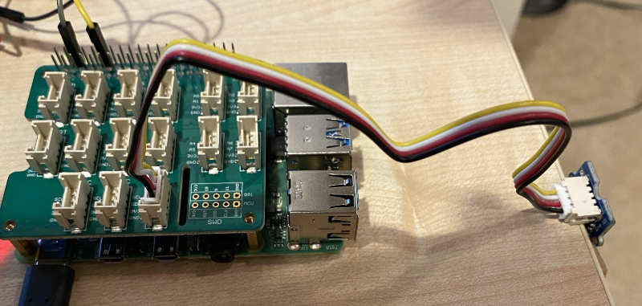

# Distance sensor

This sample shows how to light multiple LEDs based on a measurement from a distance sensor, lighting up the pumpkin when trick or treaters get near.

This code uses the [Adafruit CircuitPython NeoPixel library](https://pypi.org/project/adafruit-circuitpython-neopixel/) to control the LED strip. The distance sensor is the [Grove time of flight distance sensor](https://www.amazon.com/SeeedStudio-Grove-Flight-Distance-VL53L0X/dp/B07Q1YBH99).

## Hardware

The Grove time of flight sensor is an I<sup>2</sup>C sensor, so needs to be connected to an I<sup>2</sup>C socket on the Grove Pi Hat.



If you are putting the sensor inside a pumpkin, make sure it is sealed against the moisture inside the pumpkin using a plastic bag or similar. If you use a bag, make sure the sensor is poking through the side of the bag so you are not detecting the distance to the bag!

## Instructions

1. Clone this repo onto your Pi and navigate to this folder.

1. Ensure you have set up the Grove hardware by following the [Seeed Wiki instructions](https://wiki.seeedstudio.com/Grove_Base_Hat_for_Raspberry_Pi/#installation).

1. Install the Pip packages using `sudo`:

    ```sh
    sudo pip3 install -r requirements.txt
    ```

1. Read the `app.py` code to understand what it does.

1. Update `PIXEL_COUNT` to the number of pixels you are using.

1. Run the `app.py` sample using `sudo`:

    ```sh
    sudo python3 app.py
    ```
