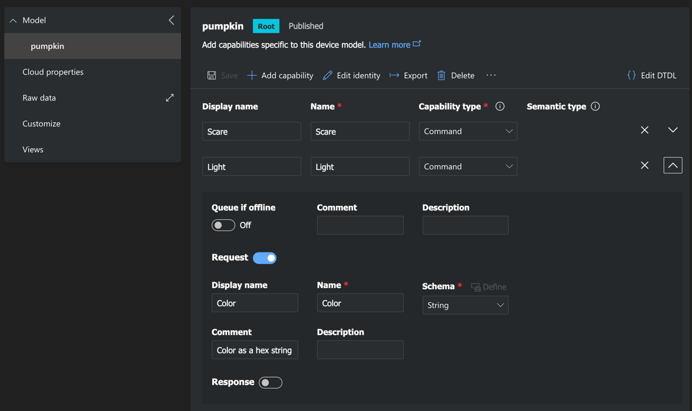

# Internet control

This sample shows how to control your pumpkin using Azure IoT Central, with lights and a spooky sound.

## Hardware

Set up the speaker and lights as described in the [`spooky-sounds`](../spooky-sounds) and [`single-pixel`](../single-pixel) demos.

## IoT Central

You will need an IoT Central app to control the app. You can find out more about how to use IoT Central in the [Azure IoT Central documentation](https://docs.microsoft.com/azure/iot-central/?WT.mc_id=academic-47288-cxa)

1. If you don't have an Azure account, sign up:

    - If you are a student, you can sign up for [Azure for Students](https://azure.microsoft.com/free/students/?WT.mc_id=academic-47288-cxa). You can also activate Azure for students via the [GitHub student developer pack](https://education.github.com/pack?WT.mc_id=academic-47288-cxa). Azure for students gives you $100 of credit each year you are a student, and you don't need a credit card to sign up.
    - If you are not a student, you can sign up for an Azure free account. You will need a credit card for verification, but your card will not be charged. This account gives you $200 of credit for the first 30 days.

1. Head to [apps.azureiotcentral.com](https://apps.azureiotcentral.com?WT.mc_id=academic-47288-cxa)

1. Create a new IoT Central app. As long as you are setting up only 1 or 2 pumpkins, IoT Central is free on any tier.

1. Create a new device template called `pumpkin` with 2 commands - `Scare` and `Light`. The `Scare` command has no parameters, and the `Light` has one `String` parameter called `Color`

    

1. Create a device with this template.

1. Get the connection details for the device.

## Instructions

1. Configure your audio device and ensure it works

1. Install the apt packages

1. Install the Pip packages using `sudo`:

    ```sh
    sudo pip3 install -r requirements.txt
    ```

1. Open the `app.py` file.

1. Read the `app.py` code to understand what it does.

1. Update the `SPEAKER_CARD_NUMBER` to the card number for your speaker.

1. Update `PIXEL_COUNT` to the number of pixels you are using.

1. Update `ID_SCOPE`, `DEVICE_ID` and `PRIMARY_KEY` to the values from the connection dialog in IoT Central

1. Run the `app.py` sample using `sudo`:

    ```sh
    sudo python3 app.py
    ```

1. Control the lights and sound from IoT Central. When executing the `Light` command, pass the required color as a 6-character hex string in the `Color` field.
